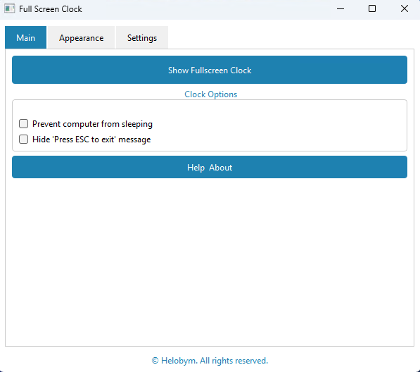

This software is developed by [Helobym](https://helobym.com)

The Full Screen Clock software provides users with a clear and visually engaging way to view the current time. When launched, it displays the time prominently, occupying the entire screen so that it is easily readable from a distance. This makes it especially useful in environments such as classrooms, offices, public spaces, or events where a large, unobstructed clock is needed for everyone to see. The design typically emphasizes simplicity and legibility, ensuring that the focus remains on the time display without unnecessary distractions. Users benefit from an always-visible, accurate clock that enhances time awareness in shared or personal spaces.

[Demo Video](httpsyoutu.beDQoWr2uKYr8)

